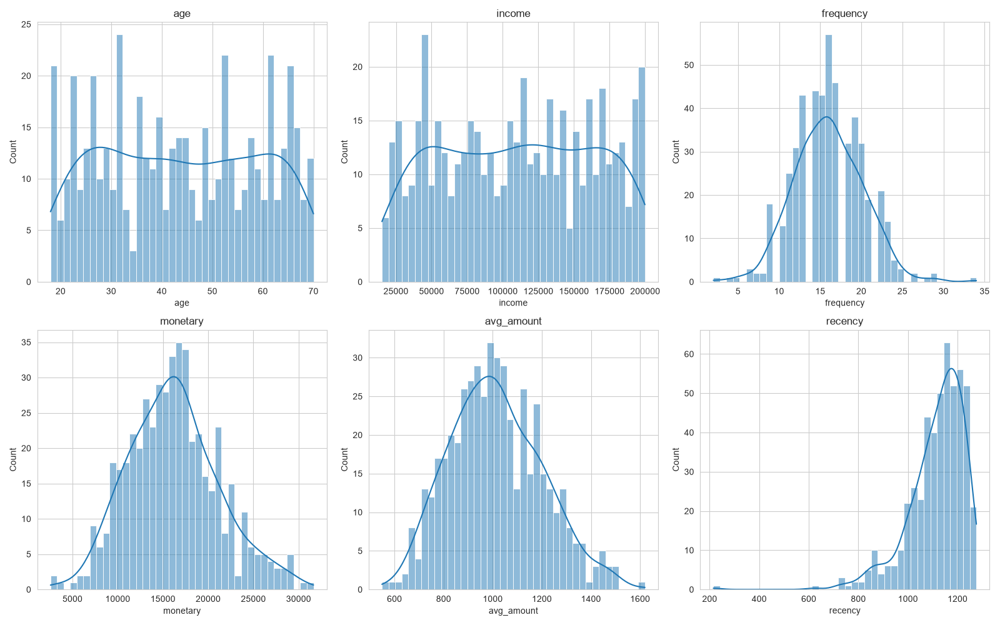

## Customer Single View and Designing Customer Data Platform
##### :family_woman_woman_girl_girl:	 ออกแบบการเก็บข้อมูลในรูปแบบทุกอย่างของลูกค้า 1 คนให้เหลือข้อมูลเพียงแค่ 1 record ซึ่งเป็นการออกแบบ Single View ของบริษัท X Property Co.Ltd.,

#### DATA SOURCE
- ข้อมูลลูกค้า (customers.csv): demographic + registration
- ข้อมูลธุรกรรม (transactions.csv): การซื้อขาย 8,000 records
- ข้อมูลสินค้า (products.csv): 25 SKUs 5 categories

#### FEATURE ENGINEERING
- **Recency**: จำนวนวันตั้งแต่ซื้อล่าสุด
- **Frequency**: จำนวนครั้งที่ซื้อ
- **Monetary**: ยอดใช้จ่ายรวม
- **Channel Preference**: ช่องทางที่ลูกค้าใช้บ่อยที่สุด
- ข้อมูลประชากร: age, income, city

#### CUSTOMER SINGLE VIEW

#### 📊 กราฟบอกอะไร?
| Feature | การแจกแจง | การวิเคราะห์ต่อ |
|---------|-----------|----------------|
| **Age** | ลูกค้าส่วนใหญ่อยู่ช่วง 25–50 ปี | กลุ่มเป้าหมายหลักคือวัยทำงาน ออก product ที่เหมาะสม |
| **Income** | ค่อนข้างเบ้ขวา (positive skew) ส่วนใหญ่รายได้ 15K–80K | มีกลุ่มรายได้สูง (outlier) ที่ควรทำโปรแกรม VIP |
| **Frequency** | ลูกค้าส่วนใหญ่ซื้อ 1–3 ครั้ง (long tail) | ต้องกระตุ้นให้ซื้อซ้ำ — เพิ่ม loyalty program |
| **Monetary** | เบ้ขวา — ส่วนใหญ่ใช้จ่ายน้อย มีกลุ่มใช้จ่ายสูงไม่กี่ราย | กลุ่ม High Spender ควรรักษาเป็นพิเศษ |
| **Recency** | กระจายตัว — มีทั้งลูกค้าที่เพิ่งซื้อและไม่ได้ซื้อนาน | กลุ่ม recency สูง = เสี่ยง churn ต้องรีบทำ campaign |
| **Avg Amount** | เบ้ขวา — order ส่วนใหญ่ไม่สูงมาก | เพิ่ม cross-sell / upsell |

> **💡 แนวทางต่อยอด:** สามารถนำ CSV ไปใช้ใน RFM Analysis (WS2), Churn Prediction (WS3), และ Customer Segmentation (WS4) ได้ทันที

---

📓 **[Open Notebook →](../notebooks/01_customer_single_view.ipynb)** | สร้าง Customer Single View ด้วย Pandas + Feature Engineering
