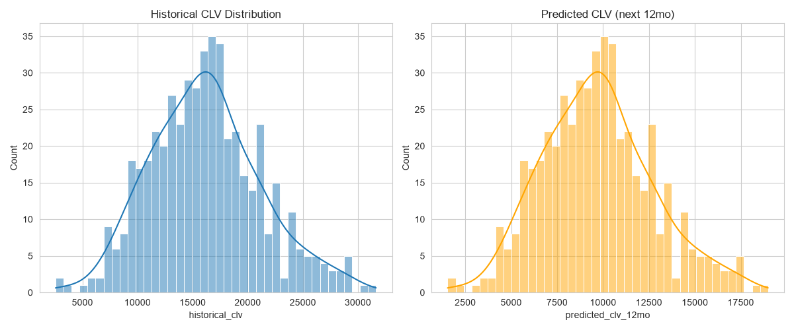
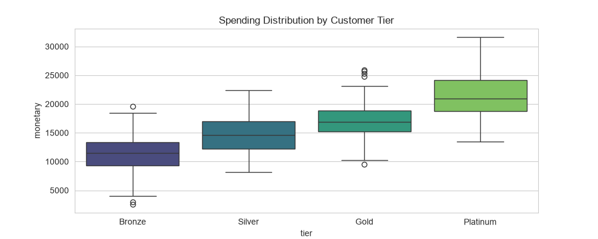

## Customer Lifetime Value and Customer Scoring
#### :bookmark:	 Customer's Analytic Data Discovery
###### Analyze data for discuss with business user and agree for next topic for detail analysis. Analyzing shopping time allows businesses to segment customers based on their shopping patterns and behavior. Businesses can personalized offers to each segment

#### :bookmark: Data Limitation
###### Only data with customer_code and Ignore null value

#### :key:	Insight 1 CLV Distribution

#### :key:	Insight 2 Customer Tier & Spending

#### :key:	Insight 3 When did the customer last purchase ?
###### Focus on continued customer and analyze lose customer

#### :key:	Insight 4 Product Hierachy by Life Stage
###### Track to focus item by life's stage

---

📓 **[Open Notebook →](../notebooks/02_clv_scoring.ipynb)** | RFM Analysis + CLV Calculation + Customer Scoring
