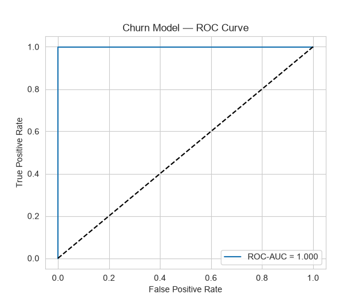
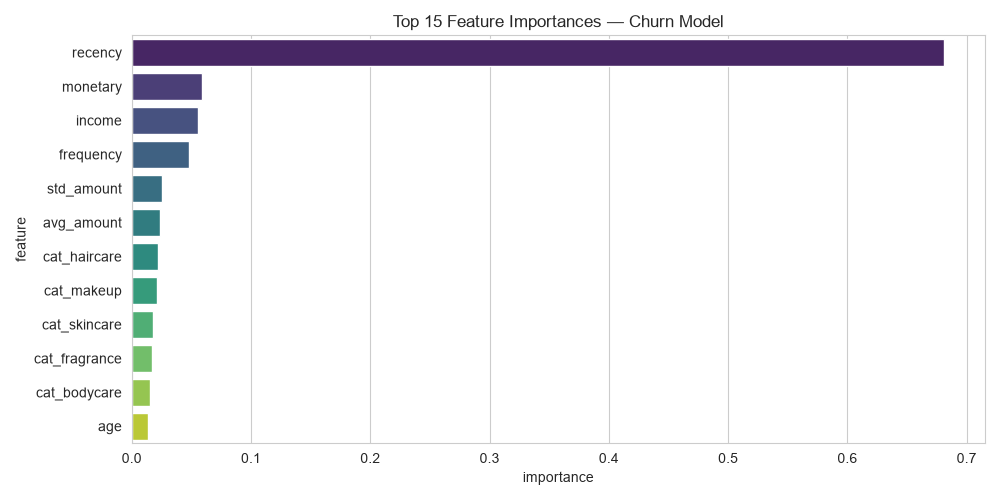
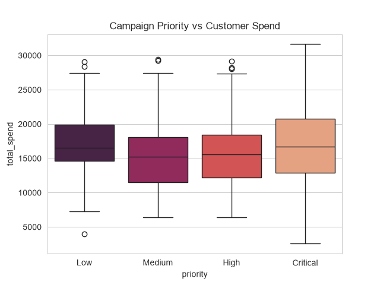

## Churn Scoring and Campaign Response Scoring

#### :shopping: CURRENTLY FOCUS BEAUTY PASS TIER ON SPEND PER 12 MONTH ONLY

#### :shopping: Current Scoring
## CV = Purchase value

#### :shopping: New scoring
#### > เมื่อลูกค้าเขียนรีวิวบนเว็บไซต์ และมีการเข้ามาอ่านรีวิว ส่งผลให้ยอดขายเพิ่มขึ้นโดยพฤติกรรมลูกค้าส่วนใหญ่จะอ่านรีวิวก่อนซื้อทุกครั้ง
#### > สินค้าแนะนำมีความแม่นยำมากขึ้น
#### > ลูกค้าใช้บริการของในร้านเดียวเพื่อสะสมพ้อยมากขึ้นทำให้พ้อยกระจายไปยังร้านอื่น ๆ น้อยลง

#### :shopping: Scoring Model
#### > :basket: Spend per 12 months 50%
#### > :basket: Point form review on website 10%
#### > :basket: Buy exclusive product 20%
#### > :basket: Training base on product 20%

---

#### CHURN MODEL — ROC Curve

#### 📊 กราฟบอกอะไร?
- **AUC (Area Under Curve)**: วัดความสามารถของ model ในการแยกลูกค้าที่จะ churn ออกจากลูกค้าที่จะ stay
  - AUC = 1.0: perfect model
  - AUC = 0.5: random (ใช้ไม่ได้)
  - AUC ≈ 0.85+ ถือว่าดีสำหรับ churn prediction
- **ROC Curve ยิ่งชิดมุมบนซ้ายยิ่งดี** — แสดงว่า model มี True Positive Rate สูง ในขณะที่ False Positive Rate ต่ำ

> **💡 วิเคราะห์ต่อ:** จุดที่เหมาะสมในการเลือก threshold ขึ้นกับ Cost-Benefit:
> - ถ้า campaign cost ต่ำ → เลือก threshold ที่ high recall (จับ churn ได้มาก)
> - ถ้า campaign cost สูง → เลือก threshold ที่ high precision (แม่นยำ)

#### Feature Importance

#### 📊 กราฟบอกอะไร?
- **Recency** (จำนวนวันที่ไม่ได้ซื้อ) เป็น feature ที่สำคัญที่สุด — ยิ่งนานยิ่งเสี่ยง churn (สัญชาตญาณถูกต้อง)
- **Frequency** และ **Monetary** มาเป็นอันดับถัดไป — ลูกค้าที่ซื้อน้อย/ใช้จ่ายน้อย เสี่ยง churn สูง
- **Std Amount**: ความผันผวนของยอดซื้อ — ถ้าผันผวนมาก อาจเป็นสัญญาณพฤติกรรมที่ไม่แน่นอน

> **💡 แนวทางต่อยอด:** ถ้า model deploy จริง ควร monitor feature importance เป็นระยะ เพราะพฤติกรรมลูกค้าเปลี่ยนไปตามเวลา (concept drift)

#### Campaign Priority Scoring

#### 📊 กราฟบอกอะไร?
- **Critical**: ลูกค้าที่มี spend สูง + churn prob สูง — ต้องรีบดำเนินการทันที (โทรติดต่อ, ส่วนลดพิเศษ, personalized offer)
- **High**: spend ปานกลาง-สูง แต่ยังมีความเสี่ยง — ทำ retention campaign
- **Medium**: spend ปานกลาง ความเสี่ยงปานกลาง — monitor เป็นระยะ
- **Low**: spend ต่ำหรือ churn prob ต่ำ — อาจไม่คุ้มค่าที่จะลงทุน campaign

> **💡 วิเคราะห์ต่อ:** ใช้คะแนนนี้จัดลำดับความสำคัญของแคมเปญการตลาดเพื่อให้ ROI สูงสุด

---

📓 **[Open Notebook →](../notebooks/03_churn_scoring.ipynb)** | Churn Prediction (Random Forest) + Campaign Response Scoring
