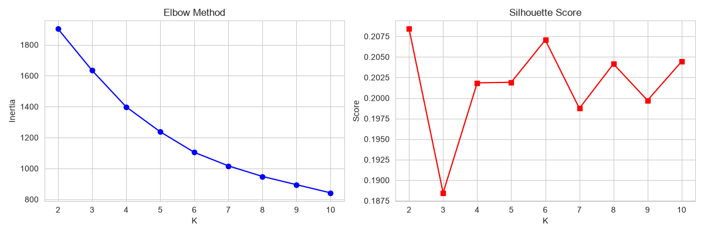
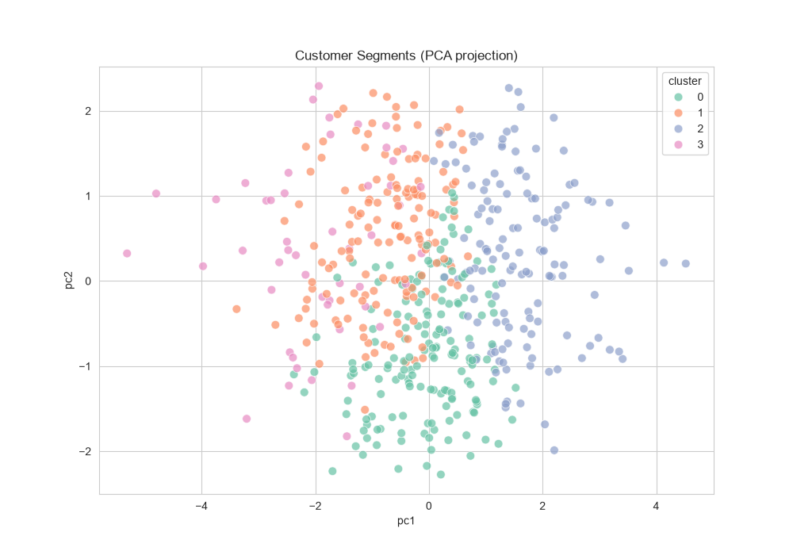

## Customer Segmentation and Product Recommendation
### :honeybee:	 :honeybee:	 HDI HOLDINGS :honeybee: :honeybee:	
### 1. Customer Segmentation
#### :bouquet: Data understanding data member
* Transaction 2021 Jan-Jun
* Transaction 2022 Jan-Dec
* Transaction 2023 Jan-July

#### :bouquet: Data Preparation
Feature engineering from transaction data + demographics

#### :bouquet: Customer Single View
RFM + demographics merged into single view

#### :bouquet: Customer Segmentation using K-mean clustering

#### :bouquet: Comparative Analysis of customer segments Over a Six-Month Period

### 2. Segment Movement Analysis

### 3. Product Recommendation
#### การเกาะกลุ่มของ Product — Association Rules

---

📓 **[Open Notebook →](../notebooks/04_segmentation_recommendation.ipynb)** | K-Means Clustering + Association Rules (Market Basket)
