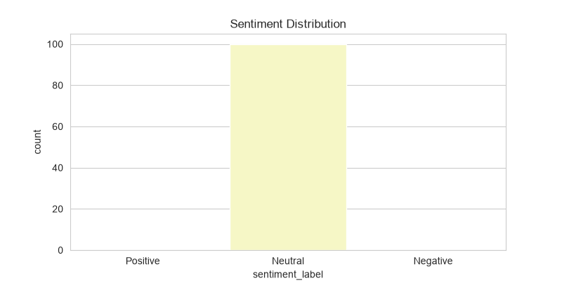
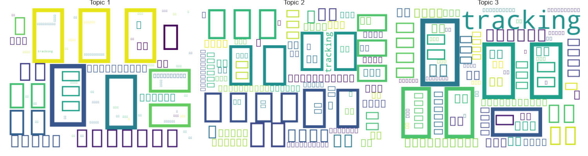
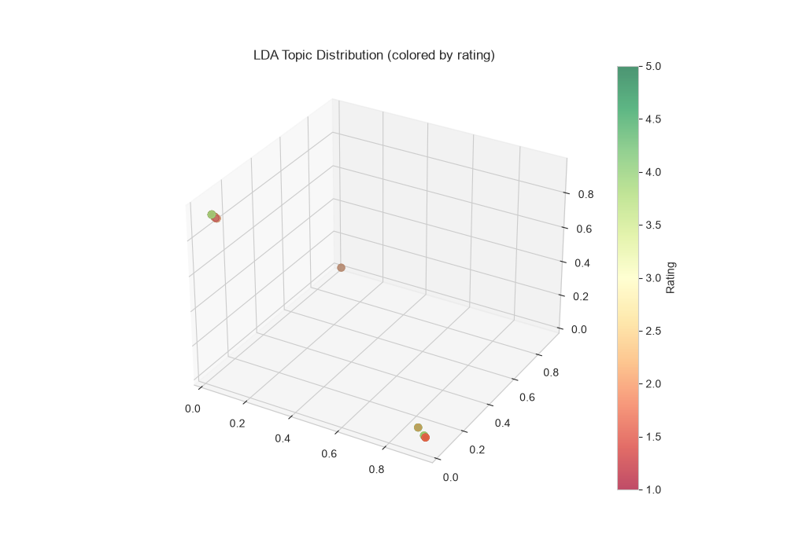

## :speaking_head: Voice of Customer Analytics
#### Data Set : [Wongnai review](https://github.com/wongnai/wongnai-corpus?fbclid=IwAR1cx9SN3JIdtSN3TT89pUFyyZEw8DGSQ8ryUx9VhKjXtNvFlj9goiEodGg)

#### Sentiment Analysis Result

#### LDA Topic Modeling — WordCloud

#### 3D Topic Distribution (colored by rating)

---

📓 **[Open Notebook →](../notebooks/05_voice_of_customer.ipynb)** | Sentiment Analysis + LDA Topic Modeling + 3D Visualization
