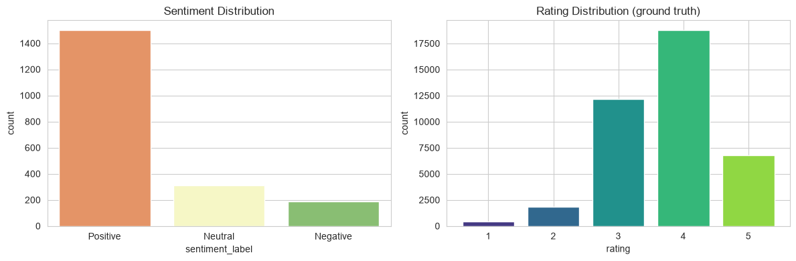
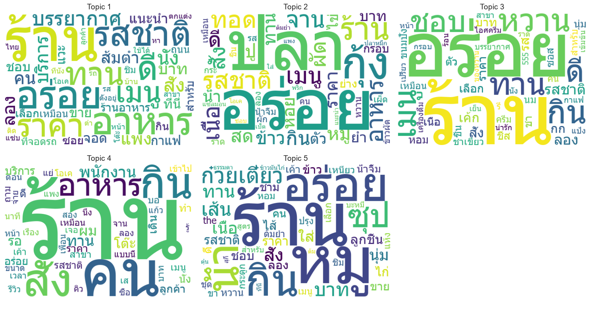
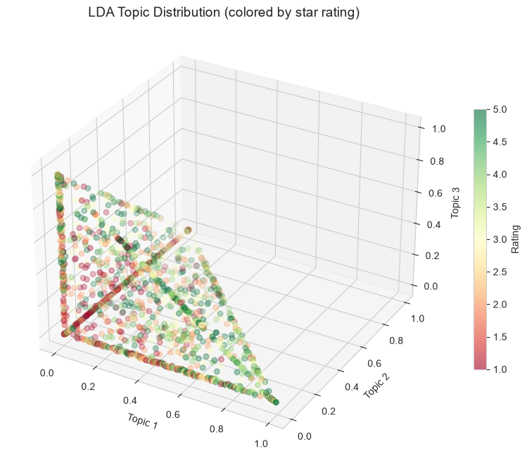
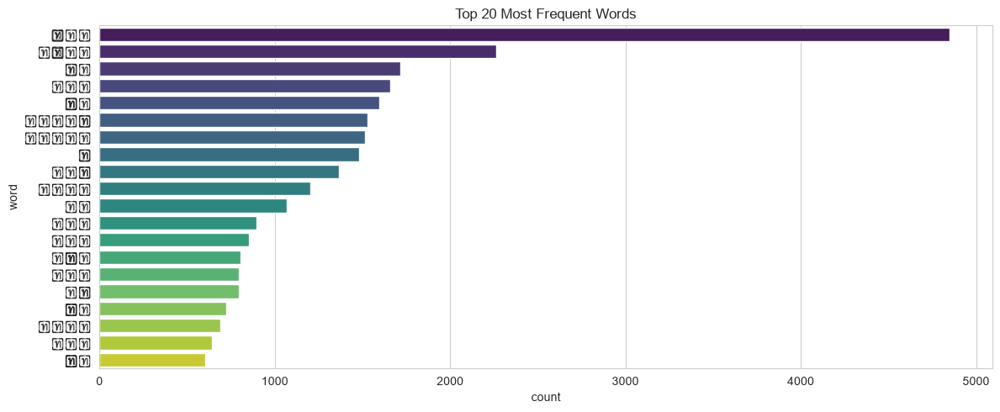

## :speaking_head: Voice of Customer Analytics
#### Data Set : [Wongnai review](https://github.com/wongnai/wongnai-corpus?fbclid=IwAR1cx9SN3JIdtSN3TT89pUFyyZEw8DGSQ8ryUx9VhKjXtNvFlj9goiEodGg)

#### Sentiment Analysis Result (vs ground truth rating)

#### 📊 กราฟบอกอะไร?
- **Sentiment Distribution (ซ้าย)**: จำนวนรีวิว Positive มีมากที่สุด รองลงมา Neutral และ Negative
- **Rating Distribution (ขวา)**: rating 4 ดาวมีมากที่สุด รองลงมา 3 ดาว — สอดคล้องกับ sentiment (positive bias)
- **ข้อสังเกต**: rating 5 ดาวมีน้อยกว่า 4 ดาว ซึ่งเป็นเรื่องปกติของ Wongnai (ผู้ใช้มักให้ 4 มากกว่า 5)

> **💡 วิเคราะห์ต่อ:** เปรียบเทียบ sentiment score กับ rating จริง — ถ้า sentiment ไม่ตรงกับ rating (เช่น พูดดีแต่ให้ 2 ดาว) แสดงว่าคำศัพท์ใน lexicon อาจไม่ครอบคลุม ควรเพิ่มคำหรือใช้ supervised learning

#### LDA Topic Modeling — WordCloud (proper Thai tokenization with PyThaiNLP)

#### 📊 กราฟบอกอะไร?
- **Topic 1–5**: แต่ละ WordCloud แสดงคำสำคัญที่ปรากฏร่วมกันในแต่ละหัวข้อ (topic)
- คำที่มีขนาดใหญ่ = มีน้ำหนักใน topic นั้นมาก
- การที่คำใน WordCloud เป็นคำภาษาไทยจริง แสดงว่า PyThaiNLP tokenizer ทำงานถูกต้อง

> **💡 วิเคราะห์ต่อ:**
> - ตั้งชื่อให้แต่ละ topic (เช่น Topic 1 = "รสชาติอาหาร", Topic 2 = "บริการ", Topic 3 = "บรรยากาศ")
> - ใช้ topic distribution วิเคราะห์ว่า rating ต่างกันให้ความสำคัญกับ topic ต่างกันหรือไม่
> - ถ้าพบ topic ที่มักเกิดกับ rating ต่ำ → แจ้งทีม operations แก้ไข

#### 3D Topic Distribution (colored by star rating)

#### 📊 กราฟบอกอะไร?
- แต่ละจุด = 1 รีวิว, ตำแหน่ง = topic composition, สี = rating (เขียว = ดี, แดง = แย่)
- ถ้ากลุ่มรีวิว rating 5 (เขียว) รวมตัวกัน แสดงว่า topic composition สัมพันธ์กับความพอใจ
- ถ้า rating 1-2 (แดง) กระจายปนกับ rating 4-5 แสดงว่า topic อย่างเดียวไม่พอต้องดู context เพิ่ม

> **💡 วิเคราะห์ต่อ:**
> - หาก clusters ของแต่ละ rating แยกกันชัดเจน → ใช้ topic composition ทำนาย rating ได้
> - หากซ้อนทับกัน → ต้องเพิ่ม features อื่น (sentiment score, word count, etc.)

#### Top 20 Most Frequent Words

#### 📊 กราฟบอกอะไร?
- คำที่พบบ่อยที่สุดในรีวิว เช่น "อร่อย" "ดี" "ร้าน" "อาหาร" "บริการ" "สะอาด"
- คำเหล่านี้คือสิ่งที่ลูกค้าให้ความสำคัญมากที่สุดเมื่อเขียนรีวิว
- ถ้า "แพง" หรือ "ช้า" อยู่ใน top 20 → เป็น pain point ที่ควรแก้ไข

> **💡 วิเคราะห์ต่อ:**
> - ใช้ word frequency ร่วมกับ sentiment: คำ positive vs negative ที่พบบ่อยสุดคืออะไร
> - ทำ Word Cloud แยกตาม rating: rating 1-2 พูดถึงอะไร, rating 4-5 พูดถึงอะไร

---

📓 **[Open Notebook →](../notebooks/05_voice_of_customer.ipynb)** | Sentiment Analysis + LDA Topic Modeling + 3D Visualization
